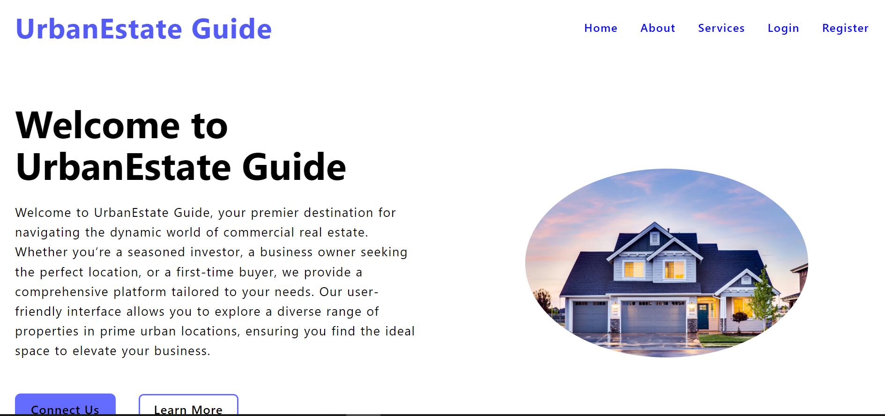
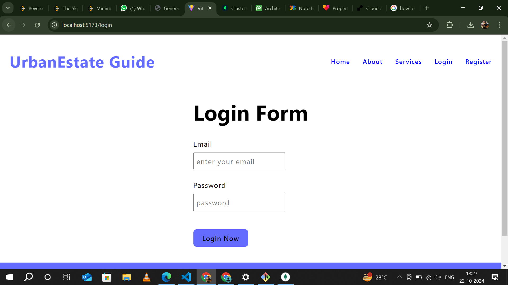

Features

Home Page

Token-Based Authentication
JWT (JSON Web Token) is employed for user authentication after logging in. When a user successfully logs in, a JWT is generated and sent to the client, containing encoded user information (like user ID). This token is then used to verify the user’s identity in future requests.

Login Page

The login form consists of fields for email and password. Users enter their credentials, which are validated upon submission to ensure accurate authentication.

Authentication Flow

Zod for Input Validation
Zod is utilized to create a validation schema that specifies rules for the form inputs. For instance, it ensures that the email is formatted correctly and that the password meets defined criteria, such as minimum length and required characters.

Registration Page

The registration page allows new users to set up an account by providing necessary details, including username, email, phone number, and password. The UI is constructed with React, while Zod manages the validation process. Upon successful submission, users are redirected to the login page.

About

Secure Password Management
To enhance security, bcrypt is utilized for hashing passwords before storing them in the database. This approach ensures that user passwords are never saved in plain text, safeguarding them against potential data breaches.

Properties Listing

Technology Stack

1. Node.js and Express.js: Handle the server-side logic, routing, and API development.
2. JWT: Integrated with Express middleware to provide secure authentication.
3. MongoDB: Used for storing user data, offering a fast, flexible, and scalable solution.
4. bcrypt: Ensures secure password hashing before storage in MongoDB.
